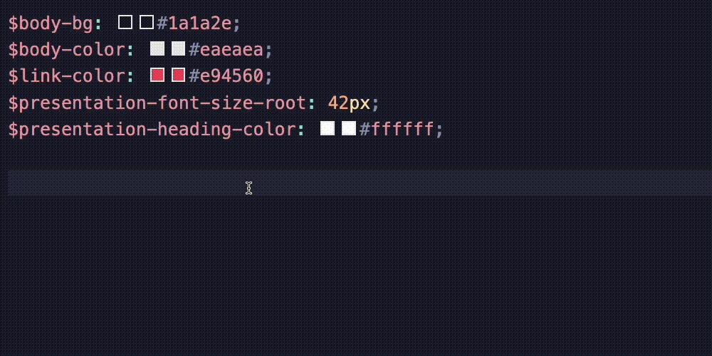
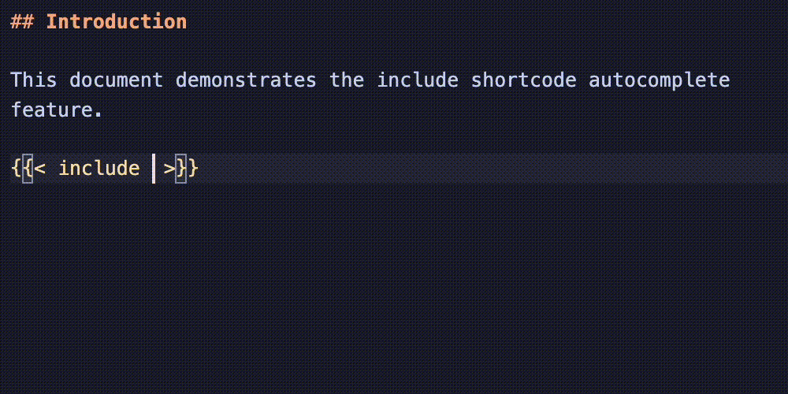
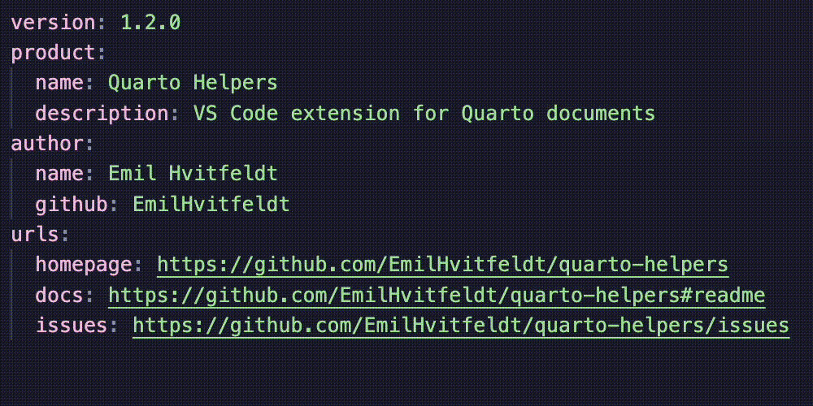
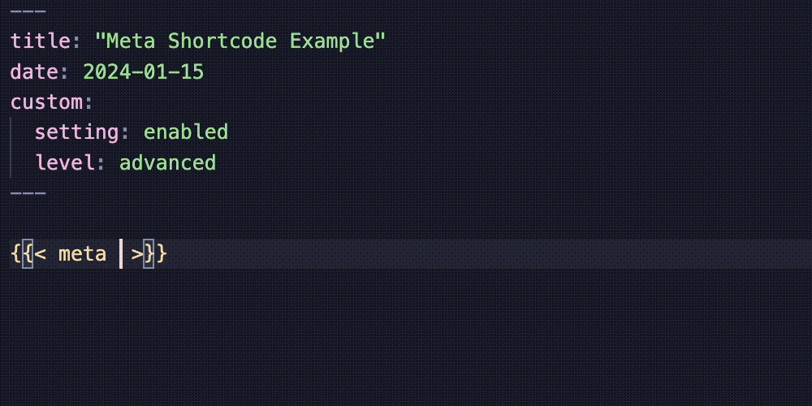
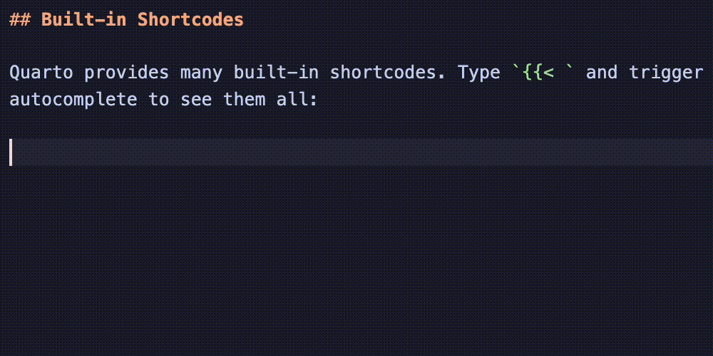
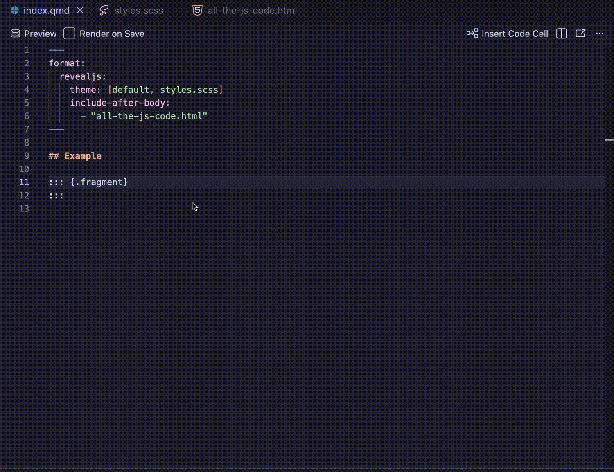
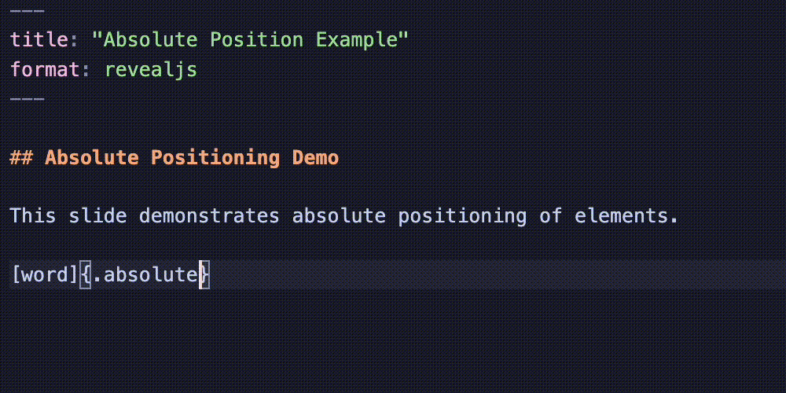
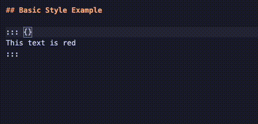

# Quarto Helpers

VS Code extension providing autocomplete and editor support for Quarto documents.

## Features

### Sass Variable Autocomplete

Provides intelligent autocomplete for Quarto Sass variables in `.scss` files. The extension automatically detects which Quarto format (RevealJS, HTML, or Dashboard) your SCSS file is used with and provides format-specific variable suggestions.

#### How It Works

Type `$` in any `.scss` file within a Quarto project to get suggestions for available Sass variables:



#### Format-Aware Completions

The extension scans your workspace for `.qmd` files and `_quarto.yml` to detect which format references your SCSS file:

- **RevealJS presentations**: Get variables like `$presentation-font-size-root`, `$presentation-h1-font-size`, `$body-bg`
- **HTML documents**: Get variables like `$h1-font-size`, `$body-color`, `$link-color`
- **Dashboards**: Get variables like `$valuebox-bg-primary`, `$card-border-radius`, `$bslib-sidebar-width`

If an SCSS file is used by multiple formats, variables from all formats are combined.

#### Variable Categories

Variables are organized by category:
- **colors**: Background, text, and link colors
- **fonts**: Font families and sizes
- **headings**: Heading sizes and styles
- **code**: Code block styling
- **layout**: Borders, spacing, and alignment
- **callouts**: Callout box colors
- **value-box**: Dashboard value box colors (dashboard only)
- **cards**: Card styling (dashboard only)
- **sidebar**: Sidebar styling (dashboard only)

**Examples:**

RevealJS (`examples/sass-revealjs/custom.scss`):
```scss
/*-- scss:defaults --*/

$body-bg: #1a1a2e;
$body-color: #eaeaea;
$presentation-font-size-root: 42px;
$presentation-heading-color: #ffffff;
```

Dashboard (`examples/sass-dashboard/custom.scss`):
```scss
/*-- scss:defaults --*/

$primary: #4a90d9;
$valuebox-bg-primary: $primary;
$card-border-radius: 0.5rem;
$bslib-sidebar-width: 300px;
```

HTML (`examples/sass-html/custom.scss`):
```scss
/*-- scss:defaults --*/

$body-bg: #fafafa;
$link-color: #0066cc;
$h1-font-size: 2.75rem;
```

---

### Include Shortcode Autocomplete

Provides file path autocomplete inside `` shortcodes, making it easy to include content from other files in your Quarto documents.

#### How It Works

Type `{{< include ` and trigger autocomplete (or press space) to get suggestions for all files in your workspace:



#### Features

- **Relative paths**: File paths are shown relative to your current document
- **All files**: Every file in your workspace is available for inclusion
- **Smart sorting**: Underscore-prefixed files (like `_content.qmd`) appear first, following Quarto's convention for include files
- **Filtered directories**: Common non-content directories are excluded (`.git`, `node_modules`, `_site`, `_freeze`, `.quarto`, etc.)

#### Why Underscore Prefix?

Quarto recommends prefixing include files with an underscore (e.g., `_chapter1.qmd`) because:
- They are automatically ignored during project rendering
- It clearly identifies them as partial content meant for inclusion

**Examples:**

```markdown





```

See `examples/include-shortcode/` for a working example.

---

### Var Shortcode Autocomplete

Provides autocomplete for Quarto's `` shortcode, which reads variables from `_variables.yml` files in your project. Type `

Contact  at 

See our [documentation]() for more info.
```

See `examples/var-shortcode/` for a working example.

---

### Meta Shortcode Autocomplete

Provides autocomplete for Quarto's `` shortcode, which reads metadata from YAML front matter and `_quarto.yml` files. Type `" was written by .
```

See `examples/meta-shortcode/` for a working example.

---

### Shortcode Name Autocomplete

Provides autocomplete for shortcode names when typing ``. Suggests both built-in Quarto shortcodes and custom shortcodes from installed extensions.

#### How It Works

Type `{{< ` to get suggestions for available shortcodes:



#### Built-in Shortcodes

All 12 built-in Quarto shortcodes are available:

| Shortcode | Description |
|-----------|-------------|
| `include` | Include content from another file |
| `var` | Output value from `_variables.yml` |
| `meta` | Print document metadata value |
| `env` | Retrieve environment variable value |
| `pagebreak` | Insert a native page break |
| `kbd` | Document keyboard shortcuts |
| `video` | Embed a video |
| `embed` | Include output from Jupyter notebook cells |
| `placeholder` | Insert a placeholder image |
| `lipsum` | Generate placeholder text |
| `version` | Display the Quarto CLI version |
| `contents` | Reorganize document content |

#### Custom Extension Shortcodes

The extension automatically discovers custom shortcodes from your project's `_extensions/` directory by parsing `_extension.yml` files.

**Example extension structure:**
```
_extensions/
  greeting/
    _extension.yml
    greeting.lua
```

**Example `_extension.yml`:**
```yaml
title: Greeting
contributes:
  shortcodes:
    - greeting.lua
```

The `greeting` shortcode will appear in autocomplete suggestions alongside the built-in shortcodes.

See `examples/shortcode/` for a working example with a custom extension.

---

### Fragment Autocomplete

Provides intelligent autocomplete for reveal.js fragment animation types inside `{.fragment }` spans.

#### How It Works

Type inside a `{.fragment }` span and press space to get suggestions for available fragment animation types:



#### Dynamic Discovery

Fragment classes are automatically discovered from your presentation's CSS files. This means:

- Standard reveal.js fragments are always available
- Theme-specific fragments are included
- Custom fragment classes defined in your CSS are detected

#### Custom JavaScript Fragments

The extension also detects custom fragment types defined via JavaScript. If your presentation includes code like:

```javascript
Reveal.on("fragmentshown", (event) => {
  if (event.fragment.classList.contains("my-custom-fragment")) {
    // custom behavior
  }
});
```

The `my-custom-fragment` class will appear in autocomplete suggestions.

#### Smart Filtering

- Only triggers inside `{.fragment }` spans
- Only suggests one fragment animation class per element
- Excludes internal classes (`visible`, `current-visible`, `disabled`)

**Examples:**
```markdown
::: {.fragment .fade-out}
This will fade out
:::

[highlighted text]{.fragment .highlight-red}

::: {.fragment .grow}
This will grow
:::
```

---

### Absolute Position Autocomplete

Provides autocomplete for RevealJS absolute positioning attributes inside `{.absolute }` blocks, enabling precise placement of elements on slides.

#### How It Works

Type `{.absolute ` and press space to get suggestions for positioning attributes:



#### Available Attributes

| Attribute | Description |
|-----------|-------------|
| `top` | Distance from the top edge of the slide |
| `bottom` | Distance from the bottom edge of the slide |
| `left` | Distance from the left edge of the slide |
| `right` | Distance from the right edge of the slide |
| `width` | Width of the element |
| `height` | Height of the element |

#### Units

Values can be specified in CSS units. Numbers without units default to pixels:

- `top=100` (100 pixels)
- `left="2em"` (2 em units)
- `width="50%"` (50 percent)

**Examples:**
```markdown
{.absolute top=200 left=0 width="350" height="300"}

{.absolute bottom=50 right=50}

::: {.absolute top=0 left=0 width="100%"}
Full-width header content
:::
```

See `examples/absolute-position/` for a working example.

---

### Style Attribute Autocomplete

Provides autocomplete for CSS properties inside `style=""` attributes within Quarto's curly brace syntax.

#### How It Works

Type inside a `style=""` attribute to get suggestions for CSS properties:



#### Property Categories

- **Colors**: `color`, `background-color`, `opacity`
- **Typography**: `font-size`, `font-weight`, `text-align`, `line-height`, etc.
- **Box Model**: `margin`, `padding`, `border`, `border-radius`
- **Size**: `width`, `height`, `max-width`, `min-height`
- **Display & Layout**: `display`, `visibility`, `overflow`
- **Flexbox**: `flex-direction`, `justify-content`, `align-items`, `gap`
- **Grid**: `grid-template-columns`, `grid-row`
- **Positioning**: `position`, `top`, `left`, `z-index`
- **Transform & Animation**: `transform`, `transition`, `animation`
- **Other**: `cursor`, `box-shadow`, `filter`, `object-fit`

#### Features

- **Property autocomplete**: Suggests CSS properties with descriptions
- **Value autocomplete**: After typing a property and `:`, suggests common values
- **Smart filtering**: Properties already in use won't appear again
- **Snippet support**: Inserts `property: ;` with cursor positioned for the value

**Examples:**
```markdown
::: {.r-fit-text style="color: red; font-size: 2em;"}
Large red text
:::

{style="border-radius: 10px; box-shadow: 0 2px 4px rgba(0,0,0,0.1);"}

[Highlighted]{style="background-color: yellow; padding: 0.2em;"}
```

See `examples/style/` for a working example.

## Configuration

Each feature can be individually enabled or disabled through VS Code settings. All features are enabled by default.

| Setting | Description | Default |
|---------|-------------|---------|
| `quartoHelpers.enableSassVariableCompletion` | Enable Sass variable autocomplete in .scss files | `true` |
| `quartoHelpers.enableIncludeShortcodeCompletion` | Enable file path autocomplete for `` shortcodes | `true` |
| `quartoHelpers.enableVarShortcodeCompletion` | Enable variable autocomplete for `` shortcodes | `true` |
| `quartoHelpers.enableMetaShortcodeCompletion` | Enable metadata autocomplete for `` shortcodes | `true` |
| `quartoHelpers.enableShortcodeCompletion` | Enable shortcode name autocomplete for `` syntax | `true` |
| `quartoHelpers.enableFragmentCompletion` | Enable fragment animation autocomplete for RevealJS presentations | `true` |
| `quartoHelpers.enableAbsolutePositionCompletion` | Enable absolute positioning attribute autocomplete for RevealJS | `true` |
| `quartoHelpers.enableStyleCompletion` | Enable CSS property autocomplete inside `style=""` attributes | `true` |

To change a setting, open VS Code settings (Ctrl+, / Cmd+,) and search for "Quarto Helpers", or add to your `settings.json`:

```json
{
  "quartoHelpers.enableFragmentCompletion": false
}
```

**Note:** Changes to these settings require reloading VS Code to take effect.

## Requirements

- VS Code 1.85.0 or higher

## Installation

<!-- TODO: Add marketplace link once published -->

1. Open VS Code
2. Go to Extensions (Ctrl+Shift+X / Cmd+Shift+X)
3. Search for "Quarto Helpers"
4. Click Install

## How It Works

The extension reads the rendered HTML file corresponding to your `.qmd` file to discover available fragment classes:

1. Parses `<link rel="stylesheet">` tags from the HTML
2. Scans CSS files for `.reveal ... .fragment.classname` patterns
3. Scans inline `<script>` tags for `classList.contains("classname")` patterns
4. Caches results for 5 seconds to improve performance

**Note:** You need to render your Quarto document at least once (`quarto render`) for autocomplete to work, as it reads from the generated HTML file.

## Development

### Setup

```bash
git clone https://github.com/EmilHvitfeldt/quarto-helpers.git
cd quarto-helpers
npm install
```

### Commands

| Command | Description |
|---------|-------------|
| `npm run compile` | Compile TypeScript to JavaScript |
| `npm run watch` | Compile and watch for changes |
| `npm run package` | Create `.vsix` package for local testing |
| `npm run publish` | Publish to VS Code Marketplace |
| `npm run publish:ovsx` | Publish to Open VSX Marketplace |

### Testing Locally

1. Run `npm run package` to create a `.vsix` file
2. In VS Code, open the Extensions view (Ctrl+Shift+X / Cmd+Shift+X)
3. Click the `...` menu → "Install from VSIX..."
4. Select the generated `.vsix` file

Or press F5 to launch the Extension Development Host with the example files.

### Publishing

#### VS Code Marketplace

1. Install vsce if needed: `npm install -g @vscode/vsce`
2. Login to your publisher account: `vsce login EmilHvitfeldt`
3. Run `npm run publish`

See the [VS Code Publishing Guide](https://code.visualstudio.com/api/working-with-extensions/publishing-extension) for more details.

#### Open VSX Marketplace

1. Install ovsx if needed: `npm install -g ovsx`
2. Get an access token from [Open VSX](https://open-vsx.org/)
3. Run `npm run package` to create the `.vsix` file
4. Publish: `ovsx publish quarto-helpers-0.1.0.vsix -p <token>`

See the [Open VSX Wiki](https://github.com/eclipse/openvsx/wiki/Publishing-Extensions) for more details.

## Contributing

Contributions are welcome! Ideas for future features:

- Autocomplete for other reveal.js attributes
- Preview fragments in editor
- Slide navigation support
- Speaker notes integration

## License

MIT - see [LICENSE](LICENSE) for details.

## Acknowledgments

- [Quarto](https://quarto.org/) - Open-source scientific and technical publishing
- [reveal.js](https://revealjs.com/) - HTML presentation framework
